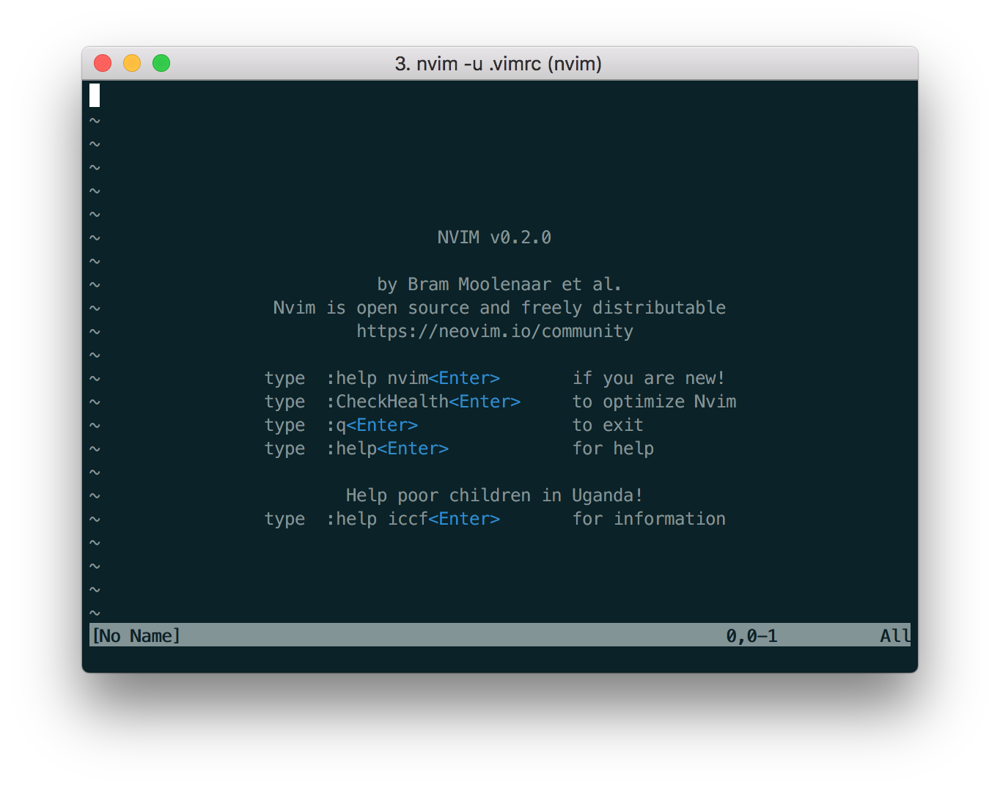
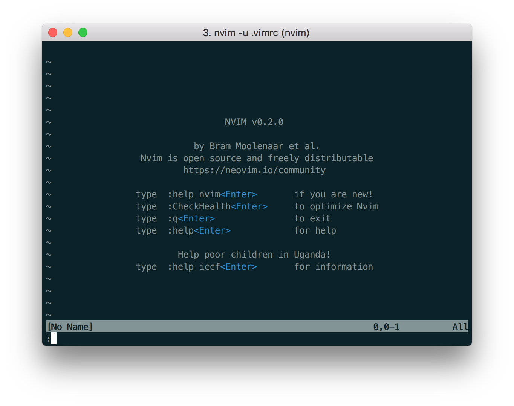
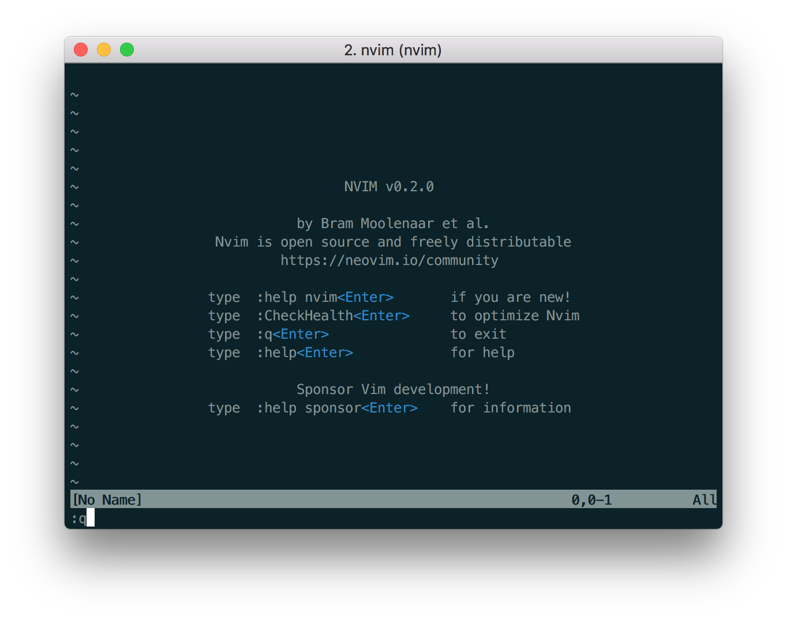

# Open and Quit


## 1. Open Vim
Okay, ready? Let's open Vim!

In your terminal, simply type `vim` :
```
$ vim
```

---
### Editor features
Vim should have loaded, looking like this:


I know, things are looking CRAZY!

Let's go through some main features:
1. Cursor. This is the solid white rectangle at the top left.

1. Tilde lines. These are the lines beginning with a `~`. These indicate lines that are
NOT in the file. To quote the [help guide](05-using-help.md), tilde lines
    > indicate that the end of the buffer has been reached.

1. File name. This is displayed in the message line. We haven't named this file we've
just opened, so `[No Name]` is displayed.

1. Current Mode. We are currently in Normal Mode. We will discuss Modes further below. Also, note that the word "Normal" is not displayed anywhere.


---
## 2. Close Vim
Now, let's quit Vim.

We need to use 3 keystrokes to exit.

First, type `:` to enter Command Mode.

```
:
```
You should see something like this:


You will notice that the cursor (white block) at the top left has moved to the bottom left,
preceded by the `:` that we just typed. This indicates that we are in Command Mode.

Then, type `q`, which is shorthand for `quit`.
```
:q
```


Then, press the `Enter` key to execute our command.


And that's it!

We have exited Vim, and we're back to the command line!

```
$
```


----
## Modes
Ok.

### Check version of Vim
We can check the version of Vim that we are using:
```
$ vim --version
```

You will probably see something like this:
```
NVIM v0.2.0
... (more information here)
```
indicating that we are using version 0.2.0

----
## Notation

We will follow a notation for commands to be type in Vim's Command Mode.

This:
```
:q
```
indicates these steps:
1. `:`, to access the Command Line, followed by
2. `q`, the command (`quit` in this case), followed by
3. `<Enter>` key (to execute our command),

