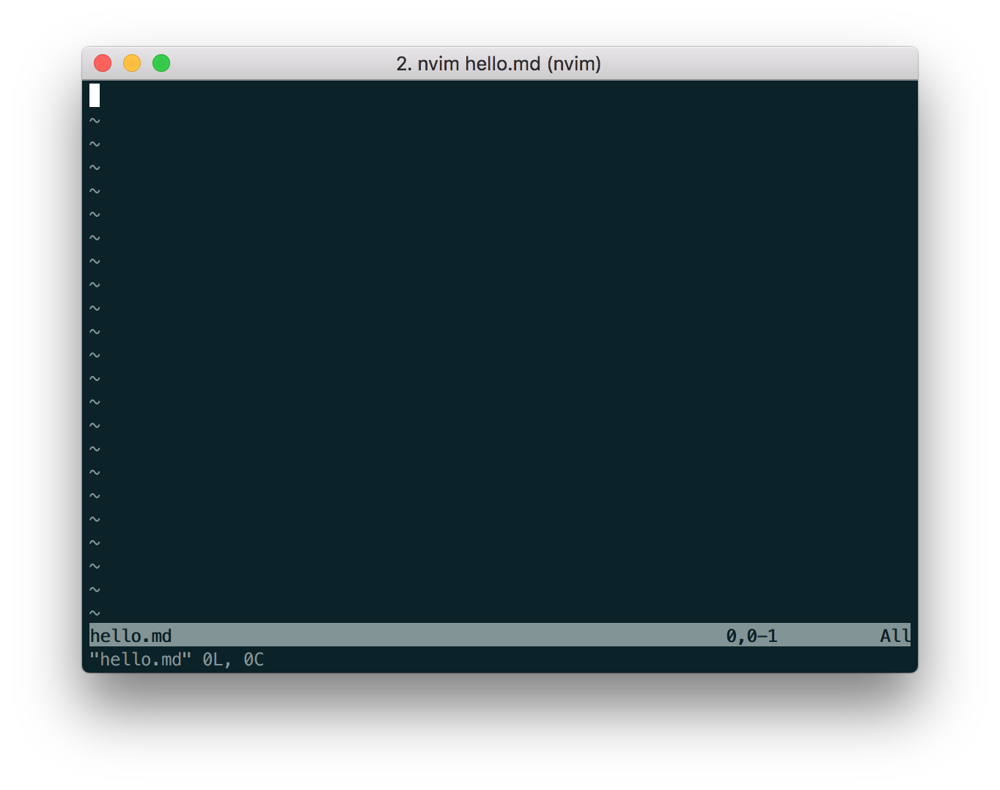
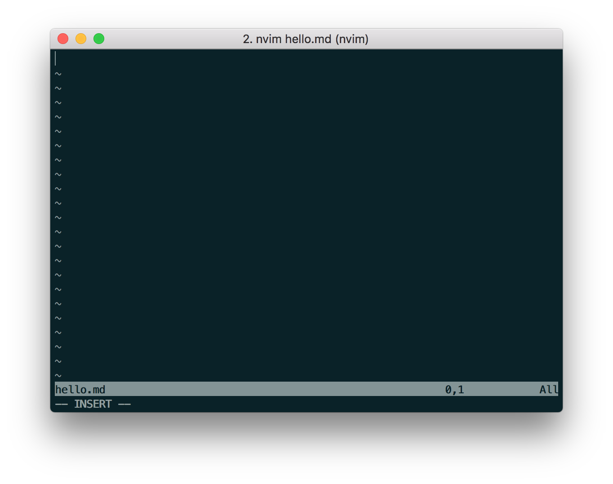
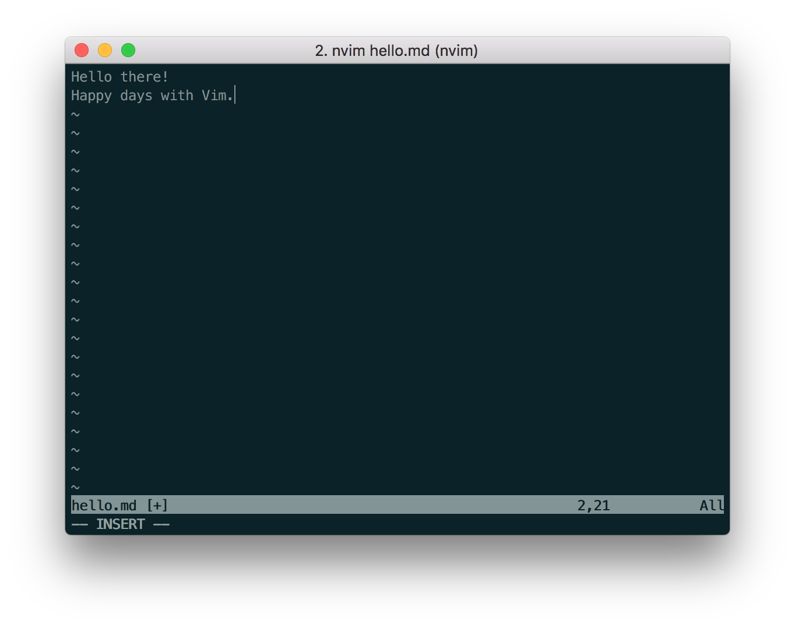
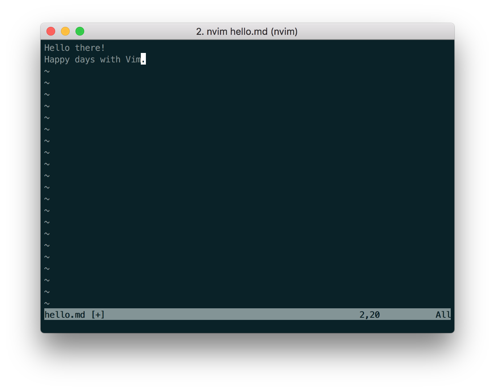
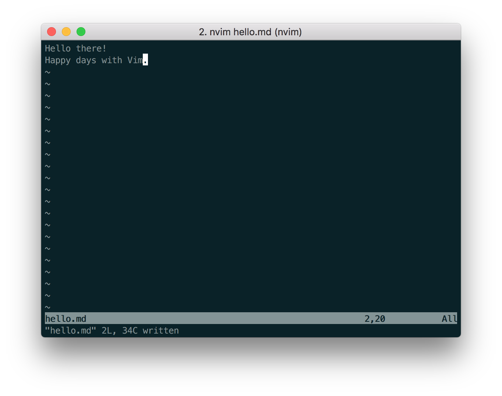

# Write and save

Let's start by creating a file, writing some text, and saving the file!


## Open file
We can open a new file with the name `hello.md`.

Note that this hasn't been written to disk yet (hello.md hasn't been saved).

```
$ vim hello.md
```

We have now opened that file inside Vim, and you should see something like this:


Things to note:
- the file name is displayed in the Message Line - "hello.md"
- the file details are displayed in the Command Line - there are zero lines (`0L`) and zero
characters (`0C`)


---
## Insert Mode
We are currently in Normal mode.
This means that we can't enter any text.

Let's enter Insert mode.
Press "i"



Things to note:
- Command line displays "--INSERT--", indicating that we are now in Insert Mode.
- The cursor has changed to a thin vertical bar, another indicator that we are in Insert Mode


## Insert text
Type a couple of lines

```
Hello there!
Happy days with Vim.
```




## Normal Mode
Now let's save our file (write to disk).

First, we need to exit Insert mode, and re-enter Normal mode.

Press `<Esc>`



Things to note:
- The Command Line now shows nothing - we are now in Normal Mode!

## Command Mode
Now we need to access the Command Line.

Press `:` to enter Command Mode.

Enter `w`, which stands for "Write" (save).

```
:w
```
Press `<Enter>`


We should see something like:


We have now saved our file!

Things to note about the information displayed in the Command Line
```
"hello.md" [New] 2L, 25C written
```
1. The file "hello.md" was saved
2. It was a new file
3. 2 lines were added
4. 34 characters were added

---
## Quit
Now that we have saved the file (written to disk), we can quit!

```
:q
```

We should now be back in the terminal.

We can confirm that our file exists:
```
$ ls
```

We should see our `hello.md` in the directory contents!


----
----
## Save and quit
We can combine the `write` and `quit` commands to achieve this
```
:wq
```

----
## Force quit (without saving)
If we are completely sure we want to close a file without saving, we can do
this:
```
:q!
```


--------------------------------------------------------------------------------
## Exercise
Make another file `icecream.md`, write a flavor of icecream in it, save, and
exit.


