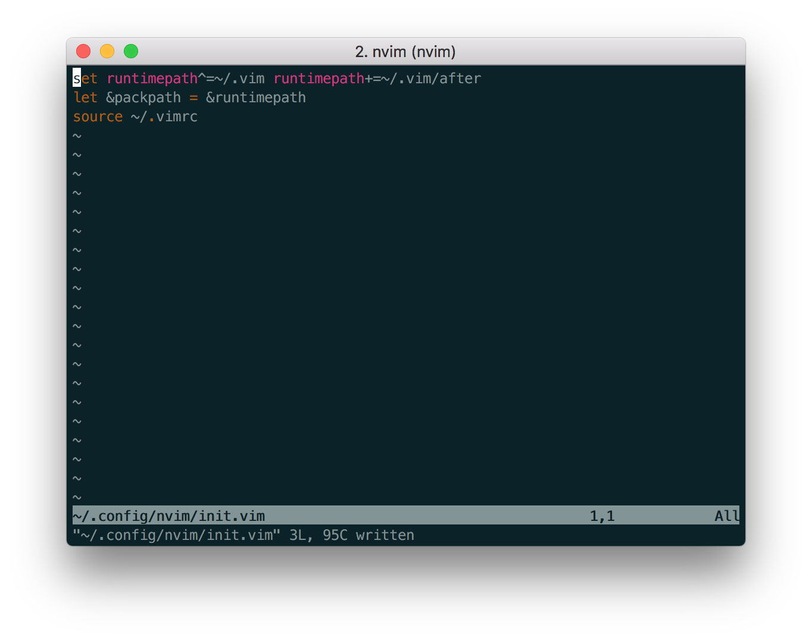
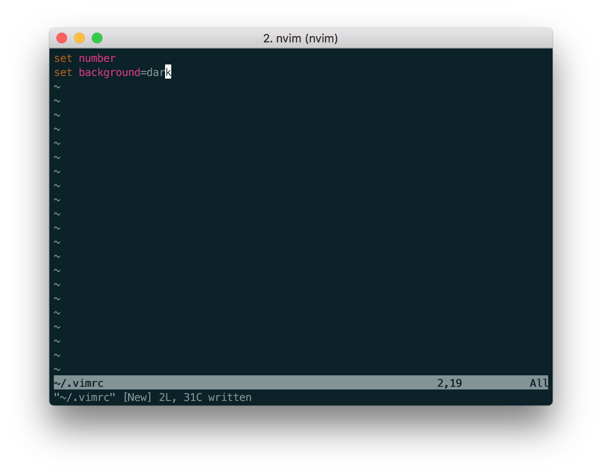
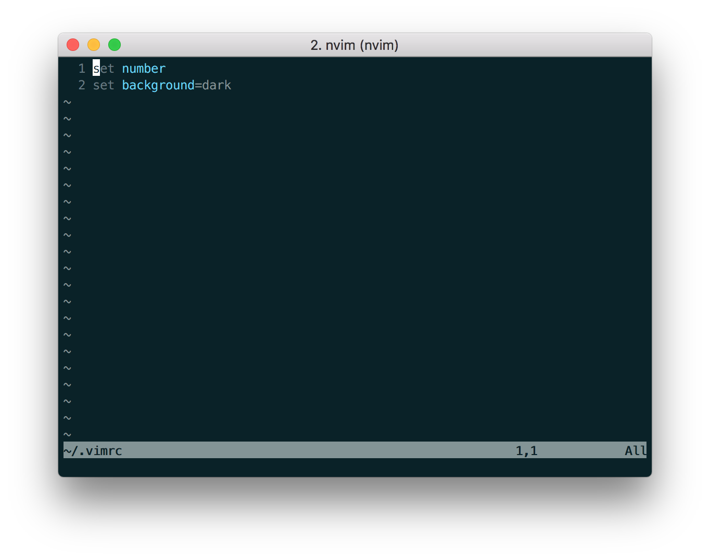
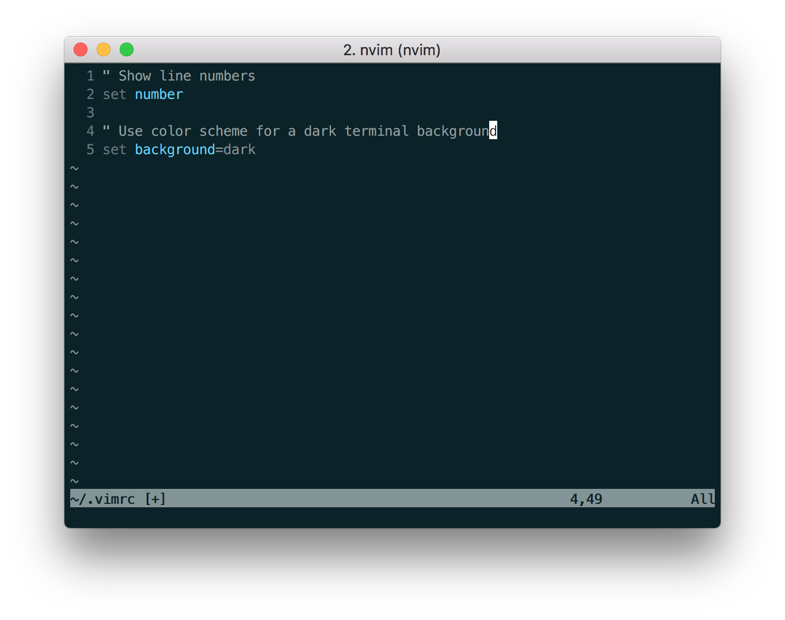
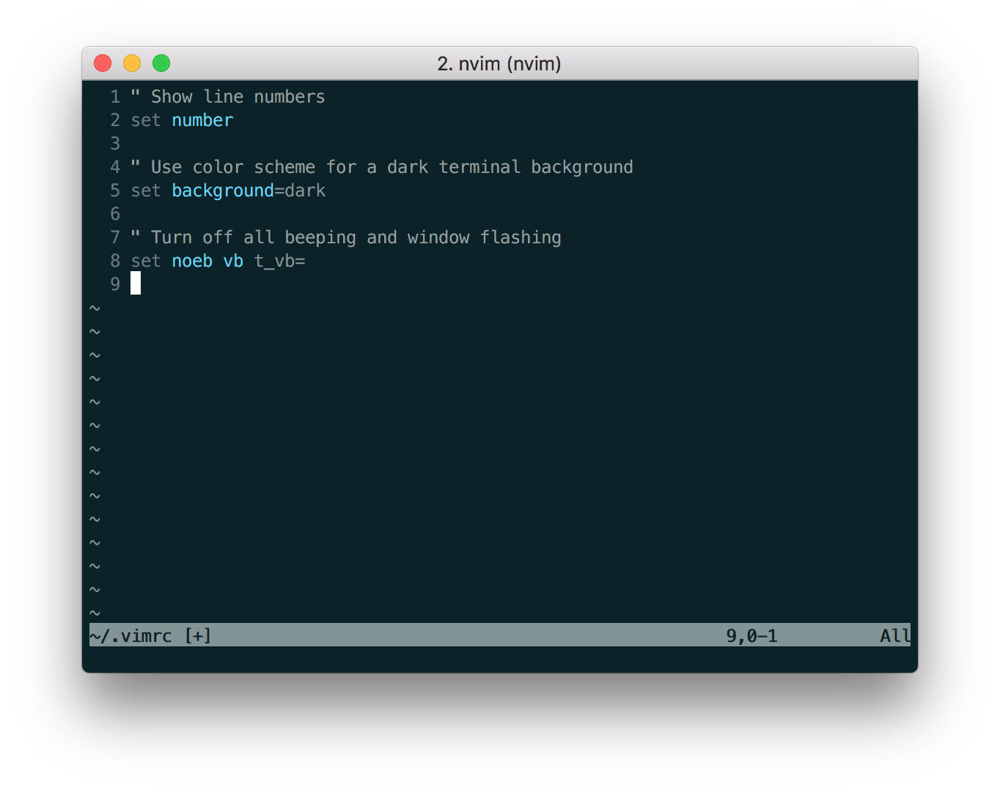

# Vimrc

Let's set up Vim to load with a configuration file.

This will allow us to set options (and a slew of other things) to be loaded each time Vim opens.

--------------------------------------------------------------------------------
## Configuration directory
Whilst the configuration file for Vim lives at `~/.vimrc`, Neovim uses `~/.config/nvim/init.vim`.

This is because Neovim supports something called XDG configuration - it uses the configuration
directory `~/.config`.

That is,
- default user config directory is now `~/.config/nvim/`
- and the default "vimrc" location is now `~/.config/nvim/init.vim`


We can ask Vim the location of its configuration file:

```
:echo $MYVIMRC
```
We will see something like this:
```
/Users/danielmoi/.config/nvim/init.vim
```

Note that this is the same as:
```
~/.config/nvim/init.vim
```


----
## `init.vim`
Let's open that our configuration file.

If you are already in Vim:
```
:edit $MYVIMRC
```

Otherwise, from the command line:
```
vim ~/.config/nvim/init.vim
```

We need to add these lines inside `init.vim` (from Neovim [documentation](https://neovim.io/doc/user/nvim.html)):
```
set runtimepath^=~/.vim runtimepath+=~/.vim/after
let &packpath = &runtimepath
source ~/.vimrc
```

As a reminder, these are the steps needed:
1. enter Insert Mode, with `i`,
2. paste in those lines of configuration
3. return to Normal Mode, with `<Esc>`
4. save file, with `:w` and `<Enter>`

What this means is that when Vim starts, it will load
1. `/$HOME/.config/nvim/init.vim`, and our `source` command will tell it to also load
2. `/$HOME/.vimrc`

After saving, your screen should look similar to this:




----
## `.vimrc`
Now, let's edit our `.vimrc`:
```
:edit ~/.vimrc
```

This should be a blank file.

Let's add our first customizations!
```
set number
set background=dark
```

After saving, your screen should look like this:


## Reload
You may have noticed that nothing has changed - there are no line numbers, and the color scheme
has not changed.

This is because these changes haven't been loaded into Vim.

We need to "tell" Vim to use these settings, ie. the current configuration file (`.vimrc`).

This is done with the `source` (abbreviated as `so`) command.

```
:so ~/.vimrc
```

Alternatively,
```
:so $MYVIMRC
```

We could also do this:
```
:so %
```
`%` refers to the current file.

---
Voila!

We should now see line numbers and a different editor background color.



Quit Vim and start Vim again to confirm that our first customizations have
persisted.


--------------------------------------------------------------------------------
--------------------------------------------------------------------------------
## Abbreviations
A lot of commands in Vim can be abbreviated.

For example, instead of `echo`, we can do `ec`.

So, instead of:
```
:echo $MYVIMRC
```

We can do:
```
:ec $MYVIMRC
```

Similarly, instead of `edit`, we can do `e`:

So, instead of:
```
:edit $MYVIMRC
```

We can do:
```
:e $MYVIMRC
```

--------------------------------------------------------------------------------
## Tab completion
Vim offers tab auto-completion. By pressing `<TAB>`, Vim will show us all commands/files/variables
starting with that initial string of characters.

If we do
```
:e<TAB>
```

Vim will provide a list of COMMANDS that begin with `e`.

We can cycle forwards with `<TAB>`, and backwards with `<SHIFT-TAB>`.

Once the desired command is selected, we can:
1. extend the command (and keep typing additional characters) with `<SPACE>`, or
2. execute immediately with `<Enter>`.

Similarly, if we do
```
:edit <TAB>
```

(noting the space after `edit`), Vim will provide us a list of FILES that can be edited.


Similarly, if we do
```
:echo $<TAB>
```

Vim will provide a list of VARIABLES that begin with `$` (ie. all of them).

--------------------------------------------------------------------------------
## Comments
As with code, it can be helpful to annotate your `.vimrc` with comments. You may forget what
certain lines are doing, and others reading the file might be interested too!

Comments in `.vimrc` begin with a `"`, and there is NO matching `"` at the end of the line:
```
" my comment
```

Let's add some comments to our `.vimrc`:



--------------------------------------------------------------------------------
## No terminal beeps

If Vim has been making beeps (eg. when the cursor reaches the end of the line),
we can turn that off.

Just like with line numbers, we need to make changes to certain OPTIONS.

Add this to `/.vimrc`:
```
" Turn off all beeping and window flashing
set noeb vb t_vb=
```

`eb` is the option for error bells, we turn this off.

`vb` is the option for visual bells, we turn this on.

`t_vb` is the option for visual bells for the terminal, we set this to empty
(which may be the reason why we have to turn visual bells on to achieve all
bells off...)



---
## Dotfiles
A common [convention](https://en.wikipedia.org/wiki/Configuration_file) for configuration files
is to have "rc" in their names.

There is also a convention for these files to be prefixed with a period ".".

Files and directories beginning with a `.` are hidden from being listed, hence their name: "dotfiles".


So, `.vimrc`
- is a configuration file for Vim
- is a hidden file, a "dotfile"

So now you know why the configuration file for Vim is named `.vimrc`!

