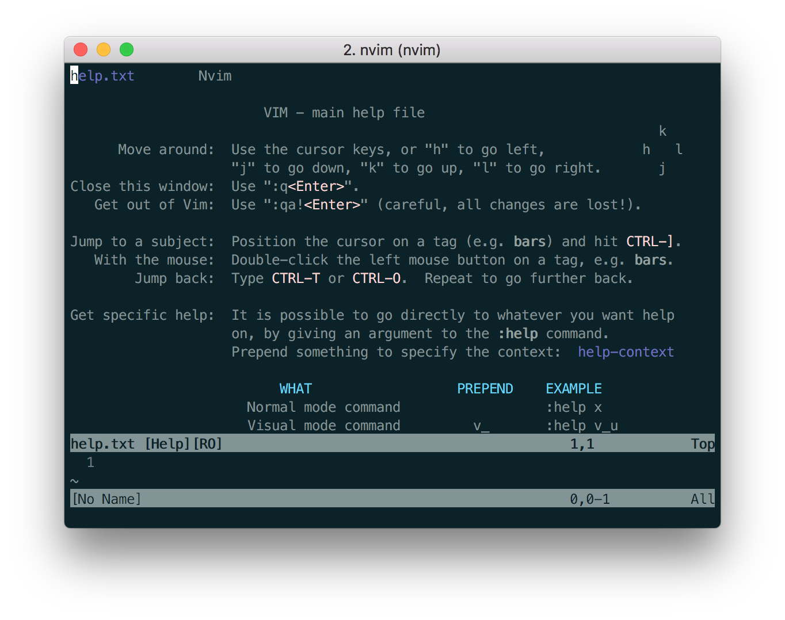
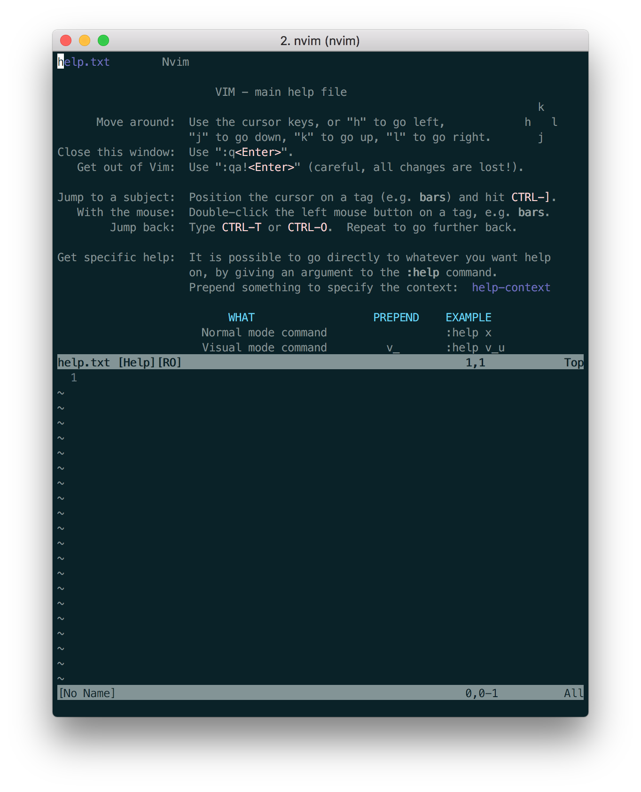
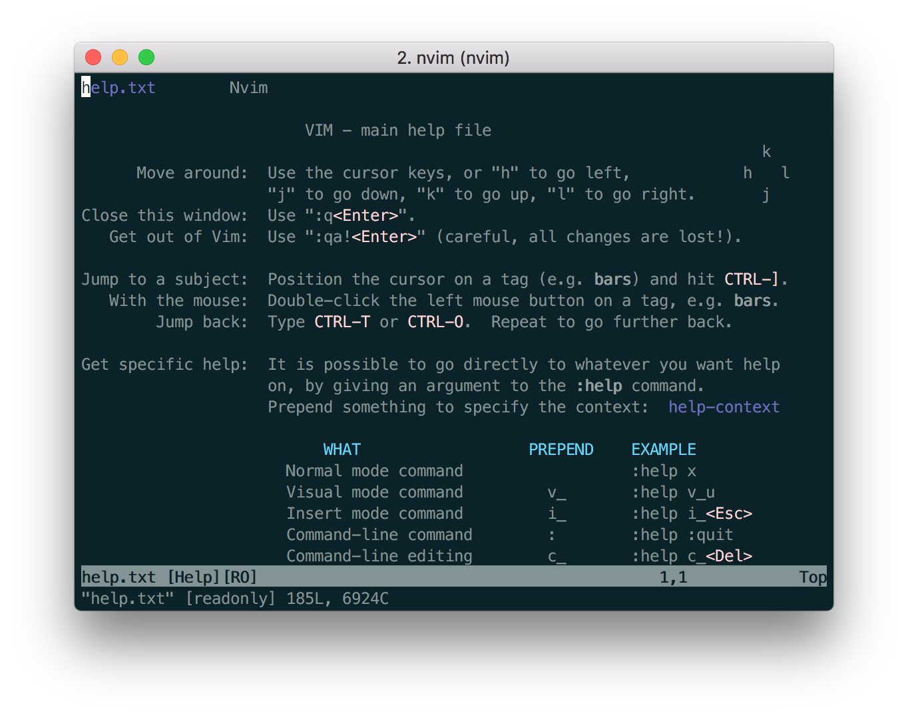

# Help

Vim ships with VERY extensive documentation. The main help file is accessible
like so:
```
:help
```
This can be abbreviated:
```
:he
```


We navigate inside the help documents using regular Vim motions,
(such as `j` for next line, `<CTRL-F>` for page down, and so on).

Note also that help opens in a separate WINDOW - our previous file (`No Name`) is still there!

This can be visualized a bit easier if we extend the height of our terminal:


We can make the help file the ONLY window visible with `only`:

```
:only
```

We can also combine commands in the Command Line using the `|` operator:
```
:he | only
```



----
## Help for specific topics
We can also access help for a specific topics. Let's look at the documentation
for `w`, which is the motion command for moving the cursor forward by one word.

```
:he w
```

----
## Help search
We can also get a list of all available commands that include the current
string, by pressing `<CTRL-D>`:

```
:he w<CTRL-D>
```

That's quite the list!

Note that there are separate help articles for `w` and `:w`
- `w` is the motion command, whereas
- `:w` is the save command.

Alternatively, we can use tab completion:
```
:he w<TAB>
```

----
## Using Help
Let's go back to the main help page.
```
:help
```

The help file starts with useful tips, such as the keys used for basic navigation.

In Vim help, we can "Jump to a subject". These sections are accessed using TAGS, the hot-links
to another section in the help manual. They are highlighted in a particular color.

When the cursor is positioned over a tag, pressing `<CTRL-]>` will jump FORWARD to that tag.

Pressing `<CTRL-T>` will go BACK one tag.

---
## Tags
Tags work by using the internal "tag stack", a list of visited tags.

To demonstrate this, navigate to a few help sections using `<CTRL-]>` over their tags.

Now, we can inspect the current tag stack like so:

```
:tags
```
