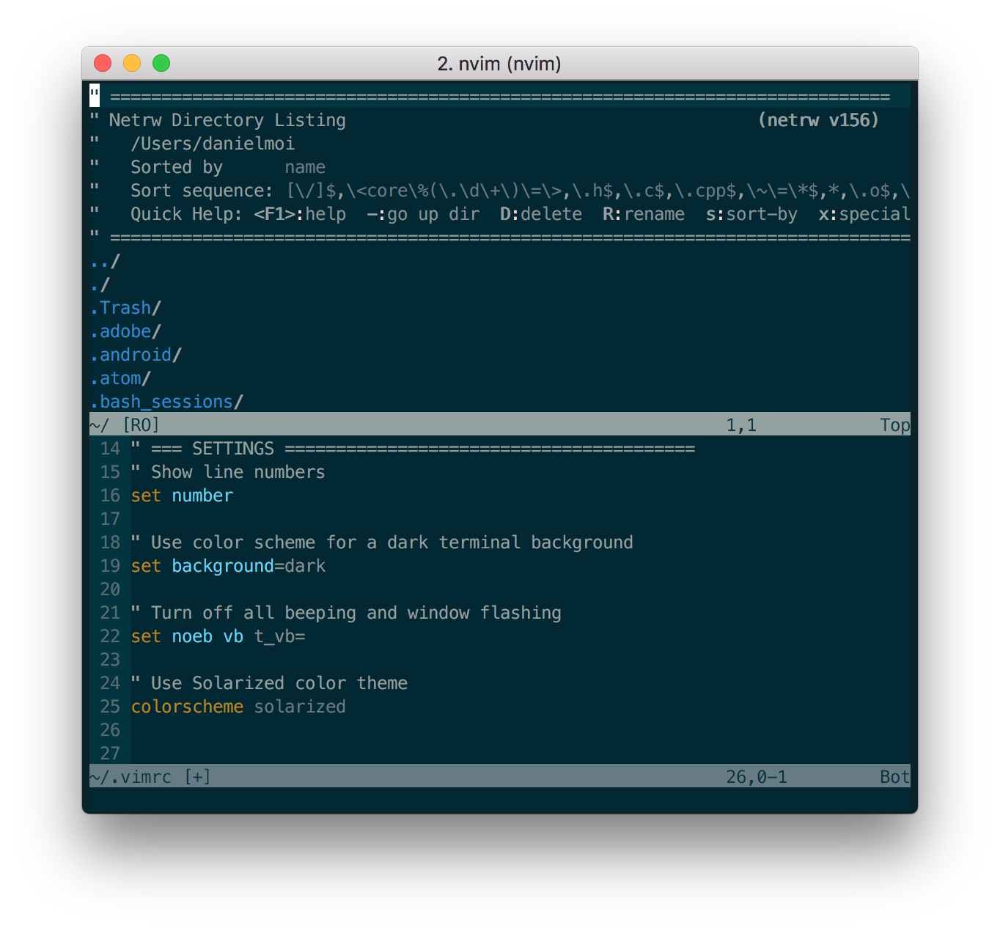
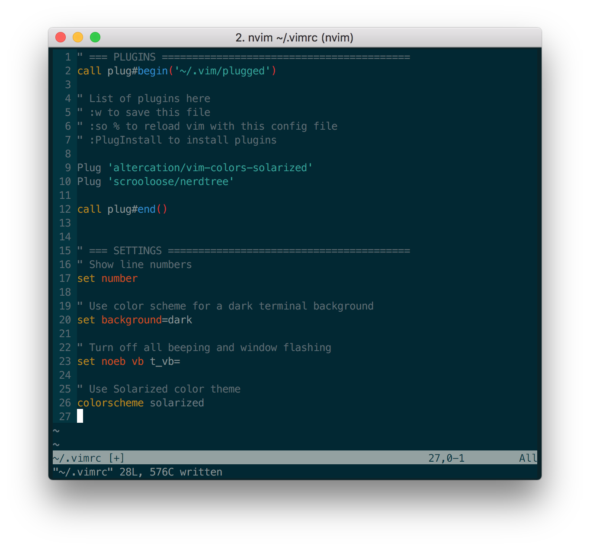
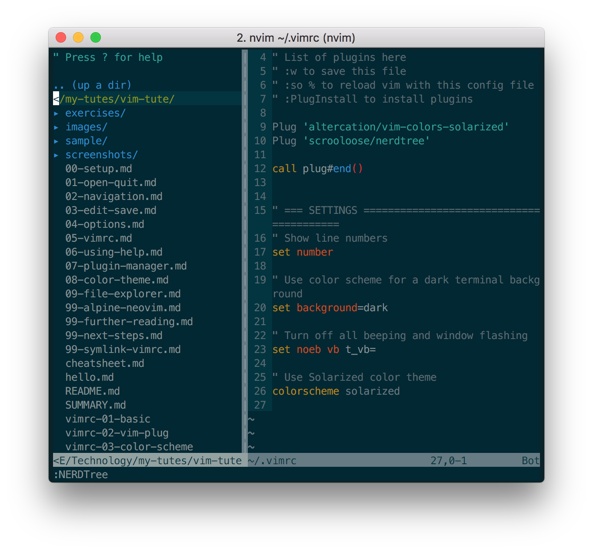

# File Explorer

Now we will look at browsing through files and directories in Vim.


---
## Explore
Let's open Vim's File Explorer window:

```
:Explore
```

You should see something similar to this:




This is the Netrw plugin that ships with Vim and is the default filebrowser.

We can use the up and down keys to navigate, and then `<Enter>` to open the file or
directory under the cursor.


---
## NERDTree
We will install another plugin, NERDTree, which provides a good filebrowser interface. This
is not crucial - you can configure Netrw to provide a similar experience. You can read about
that [here](https://shapeshed.com/vim-netrw/).

Let's add NERDTree to our list of plugins:
```
Plug 'scrooloose/nerdtree'
```



Again, we need to save, reload, run :PlugInstall, and reload again.

Now, we can open NERDTree:
```
:NERDTree
```

You should see something similar to this:


My current directory is the Git repo for this tutorial - you should see the directory
tree for _your_ current directory.

Similar to Netrw, we can navigate using Motion commands, and open files / directories
under the cursor position.


---
## Leader
Before we configure NERDTree, we will set up a `Leader` key for Vim.

A leader key allows us to create new key SEQUENCES.

The default `leader` in Vim is the backslash `\`, but we will use the comma `,` key in this tutorial.

Let's add this to our `.vimrc`:
```
" Use the comma key as the leader
let mapleader = ","
```

---
## Customize NERDTree
Now, with our leader key all set up, add the following lines to our `.vimrc`:

```
" === NERDTree ==================================
" Toggle NERDTreeToggle
map <C-n> :NERDTreeToggle<Enter>
noremap <Leader>n :NERDTreeToggle<Enter>

" Focus NERDTree
noremap <Leader>f :NERDTreeFind<Enter>

" show hidden files
let NERDTreeShowHidden=1

" close vim if NERDTree is the only thing left
autocmd bufenter * if (winnr("$") == 1 && exists("b:NERDTree") && b:NERDTree.isTabTree()) | q | endif
```

Don't forget to save and `source`!

With `<Leader>n` mapped to toggling NERDTree, the key sequence `,n` will also toggle NERDTree.

The other things achieved by those settings are explained by their accompanying comments.


---
## Your turn!
The most recent configuration - NERDTree - is a good example of why it's almost time to say
goodbye!

Those settings provide the configuration to NERDTree that _I_ find useful.

You may think differently!

In fact, if at any stage you found yourself saying "Why
are we doing this? Wouldn't it be better like this?", then you have ascertained a
fundamental principle behind Vim.

It's about configuring Vim for your own personal use.
