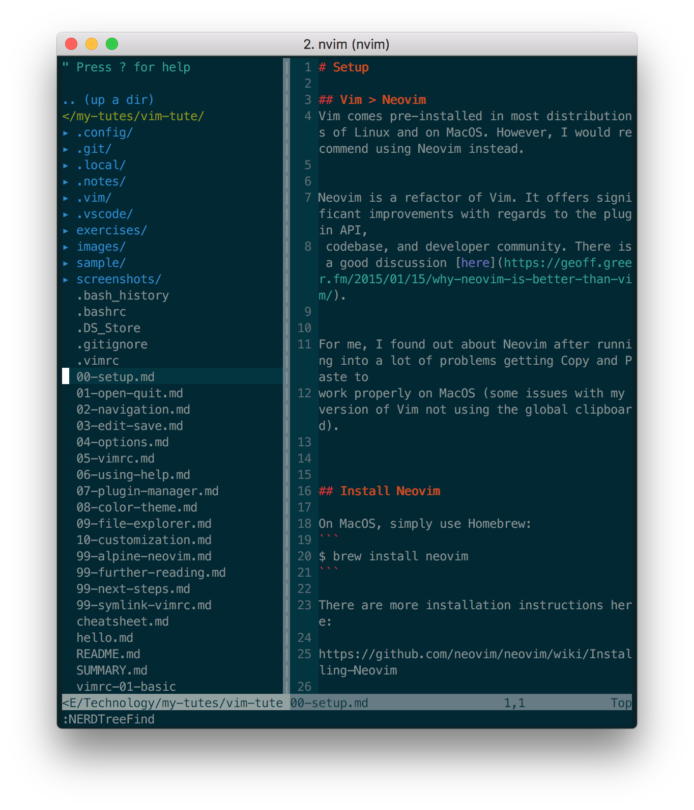
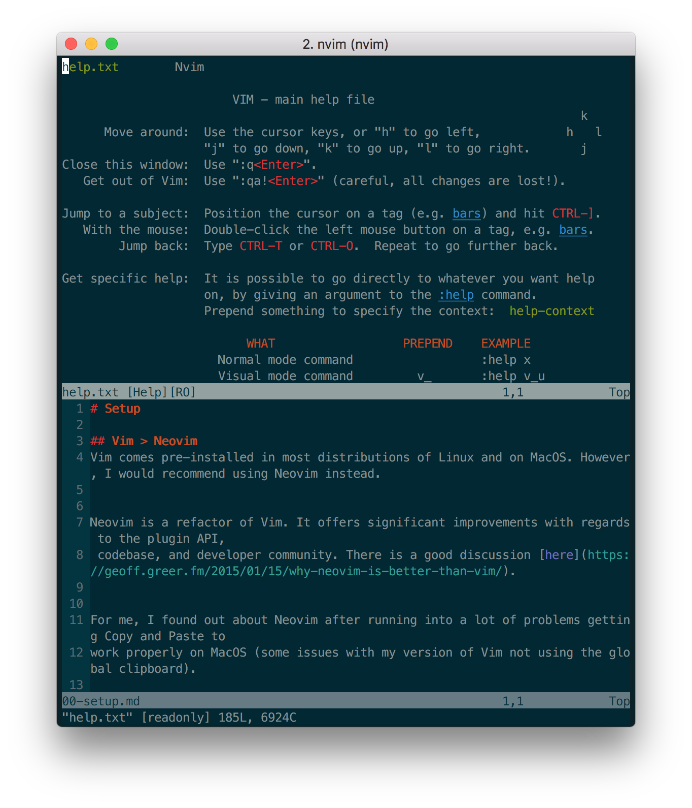

# Window switching
You have probably already run into the issue of being unable to "get back" to your file.

Probably when using Help (the cursor is in the Help section, how do I move it back to my file?):


Or when using NERDTree (the cursor is in NERDTree, how do I move it back to my file?):



This situation is called "window switching" in Vim.

Let's extend our `.vimrc`:
```
" Better window switching
map <C-j> <C-W>j
map <C-k> <C-W>k
map <C-h> <C-W>h
map <C-l> <C-W>l
```

Now, (did you remember to `source`?) when we press `<CTRL-j>`, we will move the cursor DOWN by one window.

Which is great, because `j` is the Motion command for "down"!

We can achieve this with native Vim, by pressing `<CTRL-w>`, and then the `j` key, but
this is MUCH easier.

See if you can figure out what the other mappings achieve!
