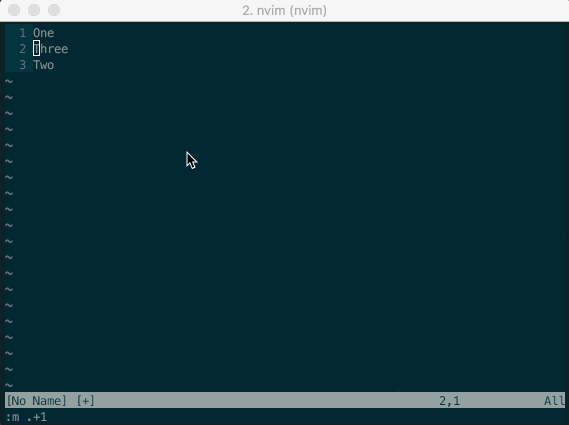

# Moving lines

Have you ever wanted to change the position of a line within a file?

```
One
Three <<<<< I want to move this down!
Two
```

One solution would be to "cut" the line
- `dd` in Vim

... and then to paste the line in the desired position
- `Y` in Vim


However, in Visual Studio Code, we get the shortcuts `<Option-UP>` and `<Option-DOWN>`.

And I REALLY wanted to implement this in Vim.

---

So I did some research and arrived at [this page](http://vim.wikia.com/wiki/Moving_lines_up_or_down)
on the Vim Wiki which gave me the solution!
```
nnoremap <A-j> :m .+1<CR>==
nnoremap <A-k> :m .-2<CR>==
inoremap <A-j> <Esc>:m .+1<CR>==gi
inoremap <A-k> <Esc>:m .-2<CR>==gi
vnoremap <A-j> :m '>+1<CR>gv=gv
vnoremap <A-k> :m '<-2<CR>gv=gv
```

What??!

It definitely works though!

I decided that I wanted to find out how those crazy commands worked. This will be one of the
best ways to learn Vim - by _understanding_ how a solution you found works.

Like a lot of "solutions" in the wiki, there are explanations provided, and I decided to cobble
together my own annotations for my own `.vimrc`, ending up with this:


```
" === MOVING LINES  ====================
" Move, in normal mode
" :m = move
" .+1 = current line number + 1
" :m+1 (same as :m+) = move current line down to current line number + 1
" == re-indents the line to suit its new position
nnoremap <A-j> :m .+1<CR>==

" move up
" same as :m-2
" move current line up to (current line number minus 2)
nnoremap <A-k> :m .-2<CR>==

" Move, in insert mode
" == reindents
" g = ?
" i = enter insert mode again
inoremap <A-j> <Esc>:m .+1<CR>==gi
inoremap <A-k> <Esc>:m .-2<CR>==gi

" we can move blocks of lines too, in visual mode
" '> = a mark that identifies the selection END
" '< = start of selection
" gv = reselects the last visual block
" = reindents
vnoremap <A-j> :m '>+1<CR>gv=gv
vnoremap <A-k> :m '<-2<CR>gv=gv
```

Here's a Gif to demonstrate:


