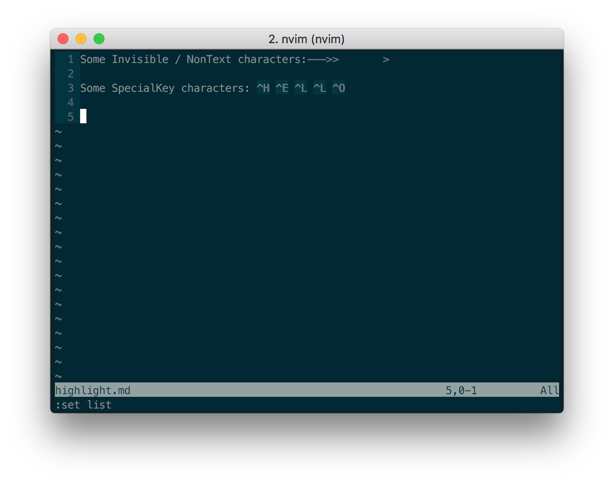
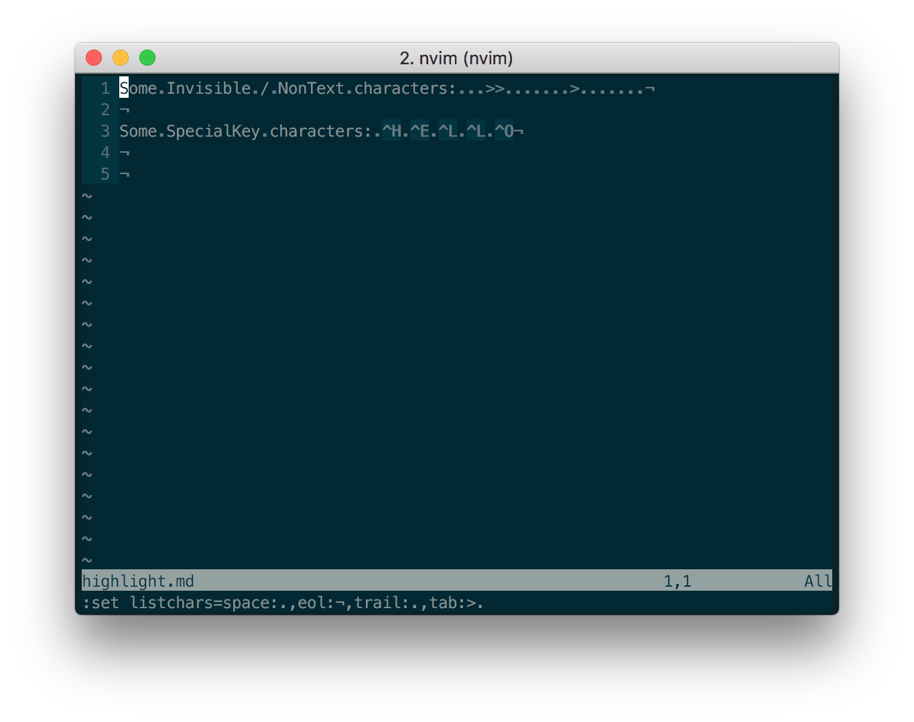
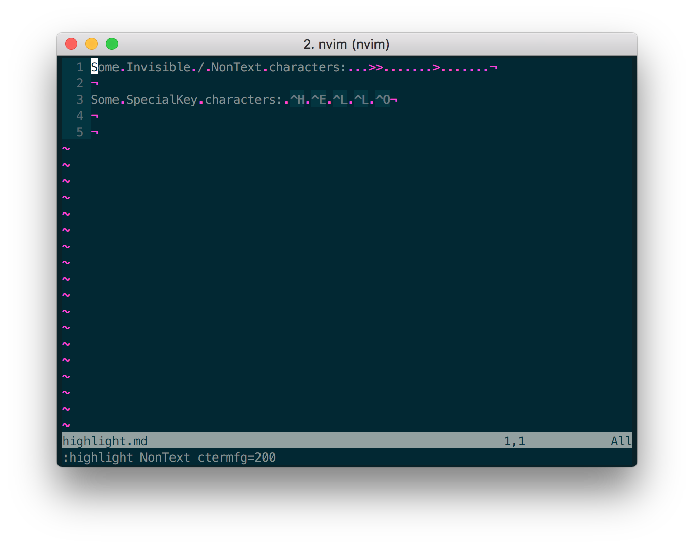
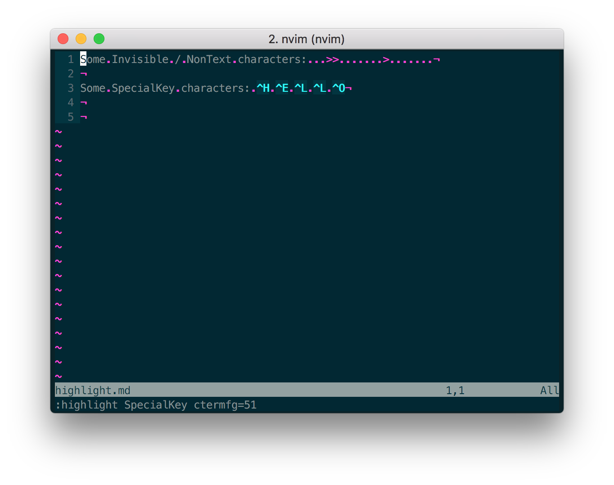
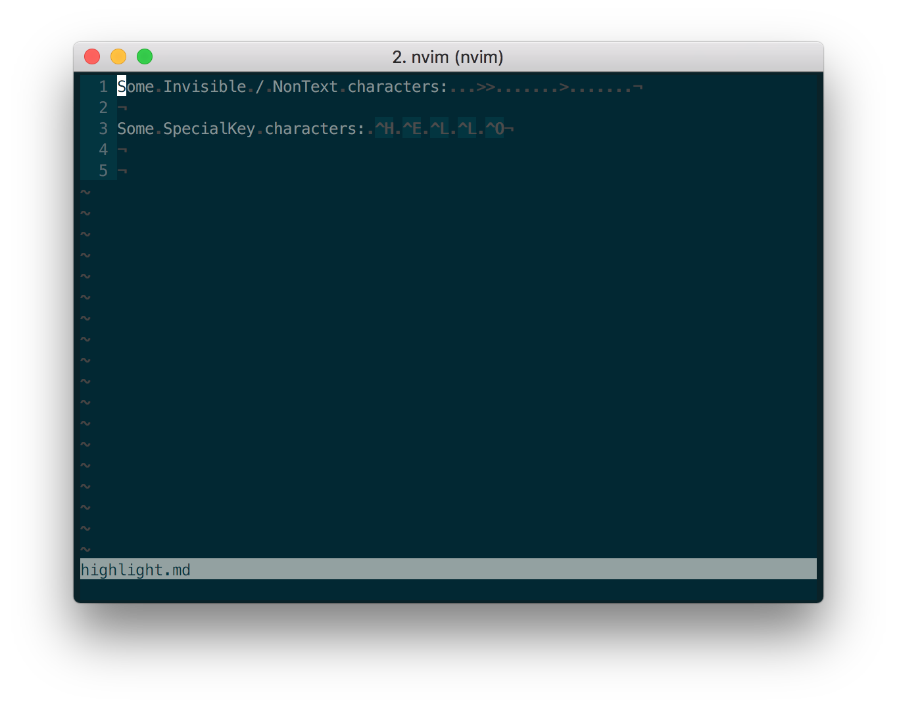

# Vim - Highlight and List

## Highlight
```
:highlight
```

This will give us a list of all the "highlight groups".

Highlight groups are types of characters, such as:
- NonText, eg. `.`, `¬`, `>`
- SpecialKey, eg. `^R`

There are 3 types of terminals for highlighting:
1. `term` - a normal terminal, eg. `xterm`
2. `cterm` - a color terminal, eg. `color-xterm` (iTerm2 is a color terminal)
3. `gui` - the Vim GUI, ie. GVim - a completely separate program

So if we had this in our `.vimrc` :
```
highlight NonText guifg=#4a4a59 ctermfg=238
```

It would be telling Vim how to highlight `NonText` characters in various environments:
1. in `gui` (ie. GVim), set the foreground color to `#4a4a59` (which is a light gray)
2. in a color terminal (such as iTerm), set the foreground color to the COLOR NUMBER `238`

Here is a list of the color names for the 256 colors that xterm can display:
http://vim.wikia.com/wiki/Xterm256_color_names_for_console_Vim

That list says that color number `238` corresponds to `rgb=68,68,68` or a hex of `#444444`,
which is also a light gray, but different to the `#4a4a59` in our example.


This would be a more accurate configuration:
```
highlight NonText guifg=#444444 ctermfg=238
```

## Display Invisible Characters

We can display invisible characters, such as SPACE and TAB, by setting the
boolean OPTION `list` to "on":
```
:set list
```



We can see that `--->>    >` has appeared.

We can fine-tune the characters show with the `listchars` string option.

This is a comma-separated list of string settings: `chartype1:chardisplay1,`

```
set listchars=space:.,eol:¬,trail:.,tab:>.
```



We can see that:
- at the end of each line, there is a `¬`
- a space character is displayed with a `.`
- tabs start with a `>`, with as many `.` needed to pad out the tab width

---
## NonText characters
Let's set some colors so we can see what's happening a bit clearer:
```
highlight NonText guifg=#ffffff ctermfg=200
```

We can see all the `NonText` characters in pink:



---
## SpecialKey characters
Now let's some more colors so we can see the `SpecialKey` characters:
```
highlight SpecialKey ctermfg=51
```
We can see all the `SpecialKey` characters in cyan:


---
## Summary
Here's our finished configuration for invisible characters:
```
set list
set listchars=space:.,eol:¬,trail:.,tab:>.
highlight NonText ctermfg=238
highlight SpecialKey ctermfg=238
```


